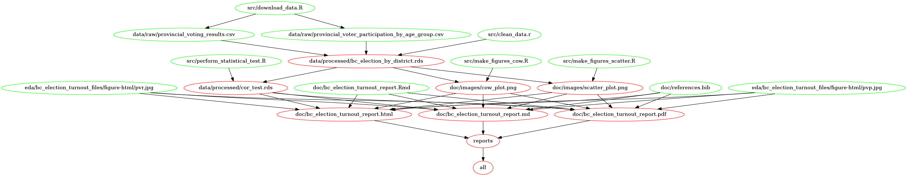

# BC Election Turnout and Competitiveness Project

authors: Kamal Moravej Jahromi, Chad Neald, Rafael Pilliard Hellwig, Yuan Xiong

date: 28/11/2020

A group project for DSCI 522 through the Master of Data Science Program at the University of British Columbia.

## About

Are close elections correlated with higher voter turnout? This is the driving question behind our project.  

We aim to determine if there is a correlation between voter turnout and the competitiveness of an election district. Specifically, we look at elections occurring in British Columbia between 2005 and 2017. To answer this question, we have used two publicly available data sets from Elections BC which "Contains information licenced under the Elections BC Open Data Licence" available [here](https://www.elections.bc.ca/docs/EBC-Open-Data-Licence.pdf) [@BC_elections_license]. The first data set is the [provincial voter participation](https://catalogue.data.gov.bc.ca/dataset/6d9db663-8c30-43ec-922b-d541d22e634f/resource/646530d4-078c-4815-8452-c75639962bb4) [@pvp] dataset and the second is the [provincial voting results](https://catalogue.data.gov.bc.ca/dataset/44914a35-de9a-4830-ac48-870001ef8935/resource/fb40239e-b718-4a79-b18f-7a62139d9792) [@pvr] dataset. These are referred to as pvp and pvr respectively throughout the project repository. 

These data sets give us the opportunity to investigate the relation between the share difference in votes between the winner and the runner up and the turn out at different electoral districts for several election years. Our hypotheses are stated below:

> **Null Hypothesis:** The correlation coefficient between the voter turnout rate and the race competitiveness is equal to zero. 

> **Alternative Hypothesis:**  The corrrelation coefficient between the voter turnout rate and the race competitiveness is not equal to zero.

Using a Pearson correlation test we arrive at a p-value of $< 0.001$ which is less than our alpha value of $\alpha = 0.05$. Our final analysis shows a positive correlation of 0.27 between voter turnout and competitiveness. Based on this information, we conclude that there is a statistically significant association between voter turnout and competitiveness for the examined elections in BC. The plot below captures the positive correlation.


## Usage

Start by cloning this directory to your local machine. Next, you may either run the analysis with GNU Make locally (Option 1), or through a docker container for maximum reproducibility (Option 2).

For both options, the steps taken by the `make all` command can be shown by the following dependency graph:




### Option 1: Running the analysis locally

To run the analysis using your local installation of R, navigate to the root of the project directory. Then start by installing the necessary dependencies from inside your R console:

```r
# Install R dependencies
install.packages("remotes")
remotes::install_deps()
```

Next, to download the data, generate the figures, and replicate the analysis of this project, run the Makefile from the root of this project by executing the following from the command line:

```bash
# Clear out all the data files and analysis
make clean

# Download the data and generate the analysis
make all
```

### Option 2: Running the analysis with Docker

For maximum reproducibility, we recommend running the entire analysis through Docker. To pull the image from DockerHub, run the following at the shell:

```bash
docker pull cneald/bc_election:latest
```

If you wish to build the image yourself instead of pulling it, you can do so by running the following at the shell from the root of the project directory:

```bash
docker build -t cneald/bc_election .
```

To run the analysis inside of the docker container (non-interactively), run

```bash
# clear out the project
docker run --rm -v $(pwd):/home/rstudio cneald/bc_election make -C home/rstudio clean

# run the project
docker run --rm -v $(pwd):/home/rstudio cneald/bc_election make -C home/rstudio all
```

Alternatively, you can also work interactively through a RStudio server session:

```bash
docker run -it --rm -e PASSWORD=abcd -v /$(pwd):/home/rstudio/ -p 8787:8787 cneald/bc_election
```

You should change the password from `abcd` to a password of your choice. If you are working on a Windows system and have challenges with the above command, you may also need to change `/$(pwd)` to an absolute path pointing to the root of the project. You can then navigate to `localhost:8787` in your browser to interact with the RStudio session.

## Dependencies

- R version 4.0.3 and R packages:
    - cowplot=1.1.0
    - dataMaid=1.4
    - docopt=0.7.1
    - GGally=2.0
    - ggpubr=0.4.0
    - ggthemes=4.2
    - here=0.1
    - janitor=2.0.1
    - tidyverse=1.3
    
## Report

The final report can be found [here](doc/bc_election_turnout_report.md)

## References

