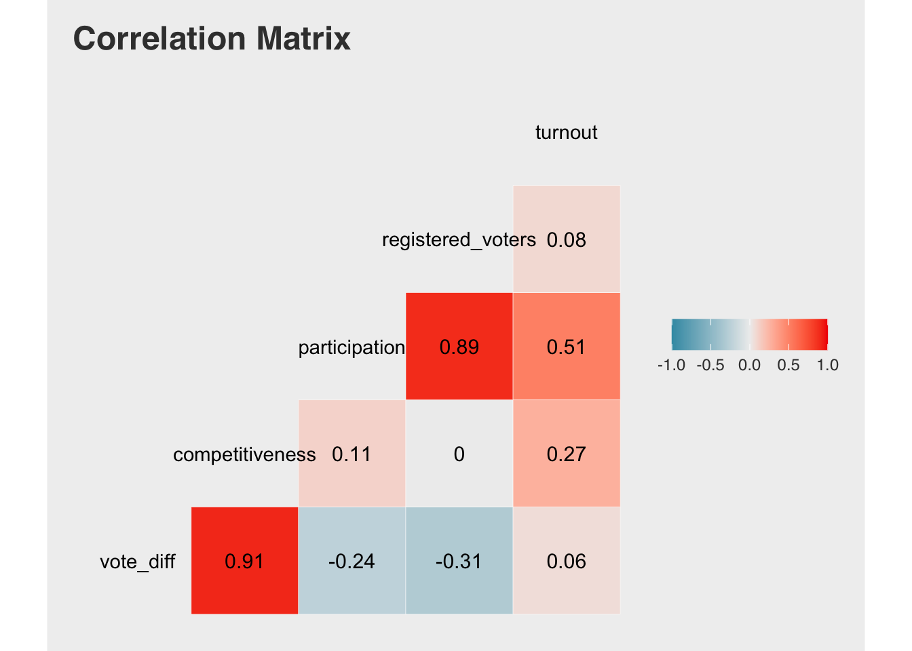
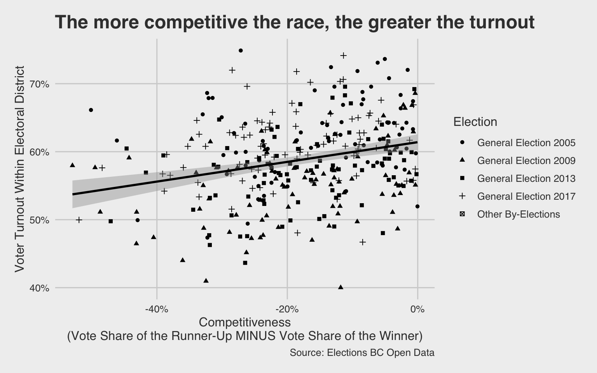

# BC Election Turnout project

## Introduction

In the past 2020 US election, it was reported [that the voter turnout rate was substantially higher in battleground states than spectator states](https://www.nationalpopularvote.com/voter-turnout-substantially-higher-battleground-states-spectator-states) [1]. We are interested to know if a similar pattern was also observed in provincial election of British Columbia in the past few years. Therefore, in this data analysis project, we work on publicly available data sets to answer the following inferential question:

> Are close elections correlated with higher voter turnout?

To answer this question, we have used two publicly available data set from BC government [provincial voter participation](https://catalogue.data.gov.bc.ca/dataset/6d9db663-8c30-43ec-922b-d541d22e634f/resource/646530d4-078c-4815-8452-c75639962bb4) and [provincial voting results](https://catalogue.data.gov.bc.ca/dataset/44914a35-de9a-4830-ac48-870001ef8935/resource/fb40239e-b718-4a79-b18f-7a62139d9792). See the terms of use of Elections BC's data [here](https://elections.bc.ca/docs/EBC-Open-Data-Licence.pdf). The data provides us voting results from 2005 - 2017 for different Electoral District (ED). This data set gives us the opportunity to investigate the relation between the share difference in votes between the winner and the runner up and the turn out at different Electoral District for several years.

To answer this question, we investigate the relationship between the following two variables measured at the level of the electoral district (ED): voter turnout rate and the competitiveness of a race. The voter turnout rate is calculated as number of valid votes cast divided by number of registered voters in an ED for a given election. An electoral district's competitiveness is calculated as the negative difference in share of the votes between winner and runner-up.  We will use a two-sided Pearson correlation test via `cor.test()` in R with the following hypotheses:

> **Null Hypothesis:** The correlation coefficient between the voter turnout rate and the race competitiveness is equal to zero. 

> **Alternative Hypothesis:**  The corrrelation coefficient between the voter turnout rate and the race competitiveness is not equal to zero. 

Our Type I error will be set at alpha = 0.05. We expect this correlation to be positive.

An exploratory data analysis (EDA) can be found in the [`eda/`](eda/) directory. The summary of `provincial voting results` dataset is as follows:


Similarly, a summary of `provincial voter participation` data set is as follows:


Looking at the correlation between different variables in our wrangled data set, we see the following correlations:



We see that there is 0.27 correlation between `turnout` and `competitiveness`. We also take a look at the turnout against competitiveness in a scatter plots with a trend line. 

 

The exploratory analysis shows that an electoral district's competitiveness is positively correlated with its voter turnout rate. This matches our expectations. More analysis will be done to complete the project in coming weeks.

## Dependencies

- R version 3.6.1 and R packages:
    - dataMaid=1.4
    - docopt=0.7.1
    - GGally=2.0
    - ggthemes=4.2
    - here=0.1
    - janitor=2.0.1
    - tidyverse=1.3
    
## Usage

The datasets needed for the exploratory data analysis are already provided in `data/raw`. To download a fresh copy of the data from the public catalogue, delete the CSV files and run the following from the command line/terminal (from the project root directory).

```bash
Rscript src/download_data.R \
    https://catalogue.data.gov.bc.ca/dataset/44914a35-de9a-4830-ac48-870001ef8935/resource/fb40239e-b718-4a79-b18f-7a62139d9792/download/provincial_voting_results.csv \
    https://catalogue.data.gov.bc.ca/dataset/6d9db663-8c30-43ec-922b-d541d22e634f/resource/646530d4-078c-4815-8452-c75639962bb4/download/provincial_voter_participation_by_age_group.csv \
    --path=data/raw
```

This will download the two datasets into a `data/raw` directory relative to your root directory. Alternatively you can specify your own relative path where to save the data.

## References

1. https://www.nationalpopularvote.com/voter-turnout-substantially-higher-battleground-states-spectator-states

