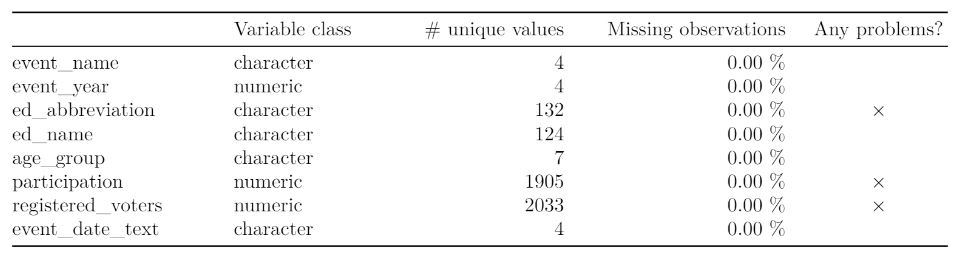

# BC Election Turnout project

## Introduction

In the past 2020 US election, it was reported that the voter turnout rate is substantially higher in battleground states than spectator states [1]. We are interested to know if a similar pattern was also observed in provincial election of British Columbia in the past few years. Therefore, in this data analysis project, we work on publicly available data sets to answer the following inferential question:

    Is a closer election correlated with the higher turnout?

To answer this question, We have used two publicaly available data set from BC government [provincial voter participation](https://catalogue.data.gov.bc.ca/dataset/6d9db663-8c30-43ec-922b-d541d22e634f/resource/646530d4-078c-4815-8452-c75639962bb4/download/provincial_voter_participation_by_age_group.csv) and [provincial voting results](https://catalogue.data.gov.bc.ca/dataset/44914a35-de9a-4830-ac48-870001ef8935/resource/fb40239e-b718-4a79-b18f-7a62139d9792/download/provincial_voting_results.csv).  See the term of use of Elections BC's data here: https://elections.bc.ca/docs/EBC-Open-Data-Licence.pdf. The data provides us voting results from 2005 - 2017 for different Electoral District (ED). This data set gives us the opportunity to investigate the relation between the share difference in votes between the winner and the runner up and the turn out at different Electoral District for several years.

To answer our research question, we investigate the relationship between the following two parameters: voter turnout rate and competitiveness. Voter turnout rate is calculated as number of votes divided by number of registered voters per ED per election event. Competitiveness is calculated as difference in share of the votes between winner and runner-up per ED per election event. Then we will use a Pearson correlation test via cor.test() in R with the following NULL and alternative hypothesizes:
 > `Null hypothsize` would be the correlation coefficient is equal to zero between the turnout rate and compatibility. 

> `The alternative hypothesis` would be the corrrelation coefficient is not equal to zero between turnout rate and compatibility. 

It will be a two-sided test. And we will decide if we can reject the null hypothesis or not based on calculated p-value.

The exploratory data analysis (EDA) is completed and uploaded into the project repository. The summary of `provincial voting results` dataset is as follows:

and, the summary of `provincial voter participation` data set is placed in the following table.

Looking at the correlation between different variables in our wrangled data set, 

We see that there is 0.27 correlation between `turnout` and `competitiveness`. We also take a look at the turnout against competitiveness in a scattor plots with a trend line. 

 

 The analysis shows that competitiveness is positively correlated to the turnout rates, which is the same as what we expected. More analysis will be done to complete the project.

## Reference
1. https://www.nationalpopularvote.com/voter-turnout-substantially-higher-battleground-states-spectator-states

