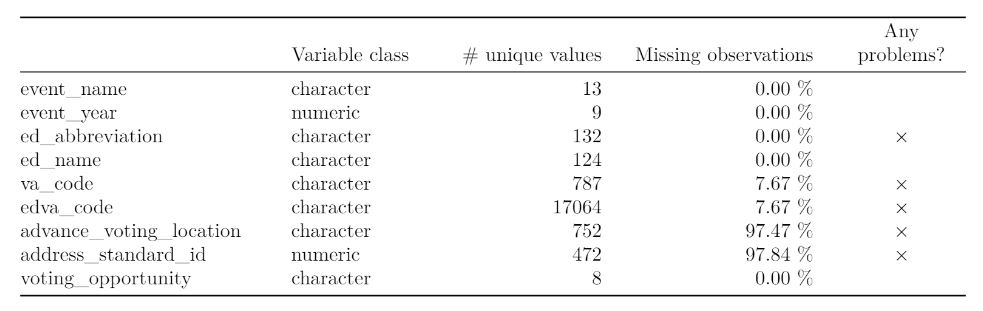
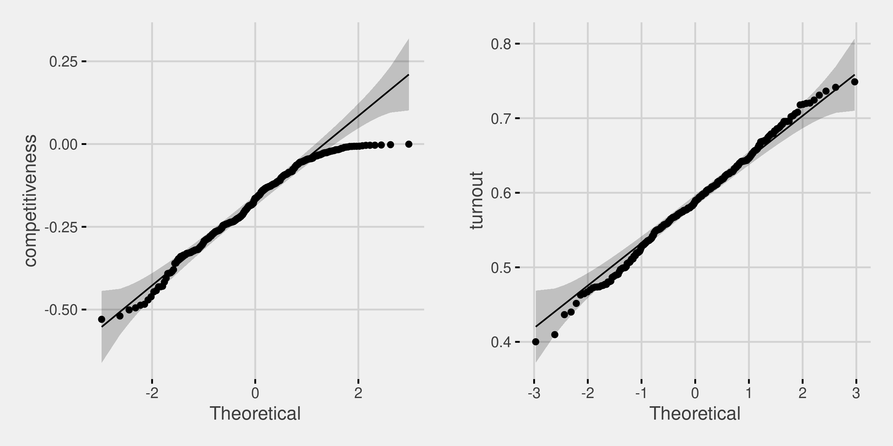
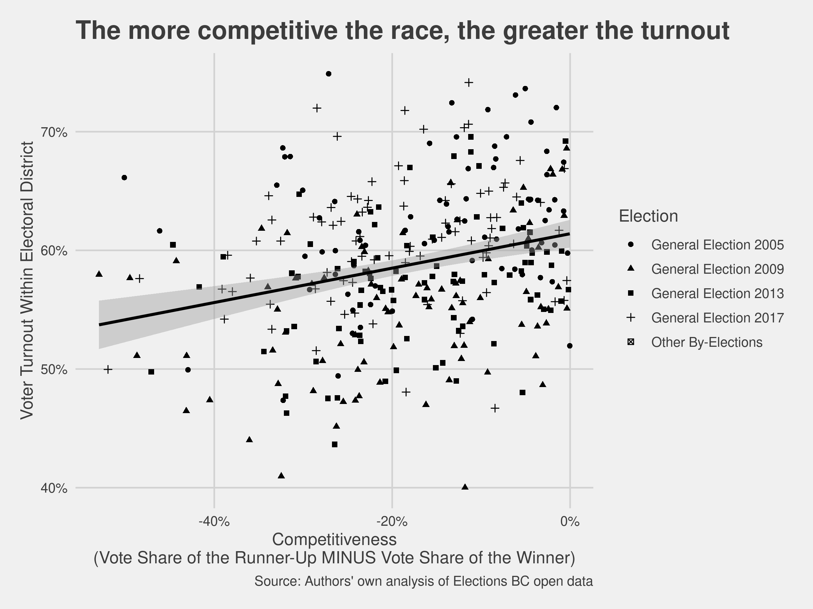

Higher Turnout Rate For Competitive Election Districts in BC
================
Kamal Moravej Jahromi
2020-12-09

  - [Summary](#summary)
  - [Introduction](#introduction)
  - [Data](#data)
  - [Analysis](#analysis)
  - [Results and Discussion](#results-and-discussion)
  - [R Packages](#r-packages)
  - [References](#references)

## Summary

The aim of the project is to determine if there is a correlation between
voter turnout and the competitiveness of an election district.
Specifically, we look at elections occurring in British Columbia between
2005 and 2017. We hypothesized at the beginning of this project that we
would find a correlation between the two variables. With our hypothesis
in place, we set a threshold of 0.05 as our probability of committing a
Type I error and we refer to this value as \(\alpha\).

To test our hypothesis, we decided to examine a two-sided Pearson
correlation test. Assumptions of the Pearson correlation test were
checked and found to be valid; therefore, we followed through with the
test and found a p-value given by \(p < .001\) and a correlation of
0.27. Based on \(p < \alpha\) we can say that there is a statistically
significant association between voter turnout and competitiveness. We
have defined our competitiveness variable so that the correlation is a
positive correlation.

## Introduction

In the past 2020 US election, it was reported [that the voter turnout
rate was substantially higher in battleground states than spectator
states](https://www.nationalpopularvote.com/voter-turnout-substantially-higher-battleground-states-spectator-states)
(“Voter Turnout Is Substantially Higher in Battleground States Than
Spectator States” 2020). We are interested to know if a similar pattern
was also observed in the provincial elections of British Columbia in the
past few years. Therefore, in this data analysis project, we work with
publicly available data sets to answer the following inferential
question:

> Are close elections correlated with higher voter turnout?

To answer this question, we have used two publicly available data sets
from the BC government; [provincial voter
participation](https://catalogue.data.gov.bc.ca/dataset/6d9db663-8c30-43ec-922b-d541d22e634f/resource/646530d4-078c-4815-8452-c75639962bb4)
(2018a) and [provincial voting
results](https://catalogue.data.gov.bc.ca/dataset/44914a35-de9a-4830-ac48-870001ef8935/resource/fb40239e-b718-4a79-b18f-7a62139d9792)
(2018b). These are referred to as pvp and pvr respectively throughout
the project repository. More details about the data can be found in the
“Data” section of this report. These data sets give us the opportunity
to investigate the relation between the share difference in votes
between the winner and the runner-up and the turn out at different
electoral districts for several years.

Subsequently, we investigate the relationship between the following two
variables measured at the level of the electoral district (ED): voter
turnout rate and the competitiveness of a race. The voter turnout rate
is calculated as the number of valid votes cast divided by the number of
registered voters in an ED for a given election. An electoral district’s
competitiveness is calculated as the negative difference in share of the
votes between winner and runner-up. We will use a two-sided Pearson
correlation test via `cor.test()` in R with the following hypotheses:

> **Null Hypothesis:** The correlation coefficient between the voter
> turnout rate and the race competitiveness is equal to zero.

> **Alternative Hypothesis:** The corrrelation coefficient between the
> voter turnout rate and the race competitiveness is not equal to zero.

Our Type I error will be set at alpha = 0.05. We expect this correlation
to be positive.

An exploratory data analysis (EDA) can be found in the `eda/` directory.

## Data

The data for this project comes from Elections BC and "\[c\]ontains
information licenced under the [Elections BC Open Data
Licence"](https://www.elections.bc.ca/docs/EBC-Open-Data-Licence.pdf).
The project makes use of the
[“provincial\_voter\_participation\_by\_age\_group”](https://catalogue.data.gov.bc.ca/dataset/6d9db663-8c30-43ec-922b-d541d22e634f/resource/646530d4-078c-4815-8452-c75639962bb4)
(2018a) dataset and the
[“provincial\_voting\_results”](https://catalogue.data.gov.bc.ca/dataset/44914a35-de9a-4830-ac48-870001ef8935/resource/fb40239e-b718-4a79-b18f-7a62139d9792)
(2018b) dataset.

The pvp dataset, as the name suggests, includes the number of votes as
well as the number of registered voters broken down by election and
election district. With this information, we can extrapolate the turnout
rate per election district for each election. A summary of the dataset
is shown in Table 1.

Table 1. Summary of provincial voting participation dataset.

The pvr dataset contains the number of votes for each candidate and
their respective party broken down again by election and election
district. From this, we can determine how competitive a race was by
calculating the difference in votes between the top two candidates. A
summary of the dataset is shown in Table 2.

Table 2. Summary of provincial voting results dataset.

## Analysis

In order to use the `cor.test()` we need to satisfy ourselves that the
assumptions of `cor.test()` are sufficiently met. The first condition of
`cor.test()` is the normality of two variables. We check the normality
using Q-Q plots (quantile-quantile plots) in Figure 1. These plots show
that the normality assumption is reasonable. The second condition is the
linearity of covariation which can be examined by looking at the scatter
plot of two variables (Figure 2). Since a visual inspection of the
scatter plot does not seem to suggest any non-linear pattern, we
consider this condition to be valid as well.

Figure 1. Q-Q plot for competitiveness and turnout.

The scatter plot of competitiveness and turnout is shown in Figure 2. It
shows that an electoral district’s competitiveness is potentially
positively correlated with its voter turnout rate. This matches our
expectations. However, in order to understand if their correlation is
statistically significant, we will use a two-sided Pearson correlation
test via `cor.test()` in R with the following hypotheses:

> **Null Hypothesis:** The correlation coefficient between the voter
> turnout rate and the race competitiveness is equal to zero.

> **Alternative Hypothesis:** The corrrelation coefficient between the
> voter turnout rate and the race competitiveness is not equal to zero.

Figure 2. A scatter plot displaying competitiveness vs turnout

## Results and Discussion

Performing the Pearson correlation test in R with `cor.test()` produces
the results in Table 3. We observe a positive correlation of 0.27
between the competitiveness of a district and its voter turnout. As the
p-value \(p < .001\) falls below our alpha threshold, we reject the null
hypothesis and conclude that the linear dependence is statistically
significant.

|  estimate | statistic | p.value | parameter |  conf.low | conf.high | method                               | alternative |
| --------: | --------: | ------: | --------: | --------: | --------: | :----------------------------------- | :---------- |
| 0.2727315 |   5.18075 |   4e-07 |       334 | 0.1707189 | 0.3689592 | Pearson’s product-moment correlation | two.sided   |

Table 3. Pearson Correlation Test Results

While the statistical test above does not make any causal claim, the
findings do align with the way many political pundits think about
certain causal relationships in elections. Namely, the common thinking
is that rivaling political parties, informed by pre-election polls,
invest more time and money in campaigning and “getting out the vote” in
districts they think might swing the election. This behaviour is likely
a product of our “first-past-the-post” system, in which the winner takes
all. An interesting angle of analysis to probe this potential
explanation further would be to compare whether this correlation holds
in jurisdictions that use proportional representation.

Subsequent analysis could also continue to build out a model explaining
the voter turnout through multiple regression. Some key variables
explored during the exploratory stages includes marginally predictive
variables such as the election year. Inclusion of additional variables –
and careful quasi-experimental methods and analysis – could help build
this model out to a more useful and actionable model for actors in the
political space.

## R Packages

This project was carried out using the R programming language (R Core
Team 2020). The following packages were used within R to carry out the
exploratory data analysis and the final analysis: broom (Robinson,
Hayes, and Couch 2020), cowplot (Wilke 2020), dataMaid (Petersen and
Ekstrøm 2019), docopt (de Jonge 2020), dplyr (Wickham, François, et al.
2020), GGally (Schloerke et al. 2020), ggpubr (Kassambara 2020),
ggthemes (Arnold 2019), here (Müller 2020), httr (Wickham 2020a),
janitor (Firke 2020), knitr (Xie 2020), stringr (Wickham 2019), testthat
(Wickham 2011), tidyr (Wickham 2020b), and tidyverse (Wickham, Averick,
et al. 2019).

## References

Arnold, Jeffrey B. 2019. *Ggthemes: Extra Themes, Scales and Geoms for
’Ggplot2’*. <https://CRAN.R-project.org/package=ggthemes>.

de Jonge, Edwin. 2020. *Docopt: Command-Line Interface Specification
Language*. <https://CRAN.R-project.org/package=docopt>.

“Elections Bc Open Data Licence.” n.d.
<https://www.elections.bc.ca/docs/EBC-Open-Data-Licence.pdf>.

Firke, Sam. 2020. *Janitor: Simple Tools for Examining and Cleaning
Dirty Data*. <https://CRAN.R-project.org/package=janitor>.

Kassambara, Alboukadel. 2020. *Ggpubr: ’Ggplot2’ Based Publication Ready
Plots*. <https://CRAN.R-project.org/package=ggpubr>.

Müller, Kirill. 2020. *Here: A Simpler Way to Find Your Files*.
<https://CRAN.R-project.org/package=here>.

Petersen, Anne Helby, and Claus Thorn Ekstrøm. 2019. “dataMaid: Your
Assistant for Documenting Supervised Data Quality Screening in R.”
*Journal of Statistical Software* 90 (6): 1–38.
<https://doi.org/10.18637/jss.v090.i06>.

R Core Team. 2020. *R: A Language and Environment for Statistical
Computing*. Vienna, Austria: R Foundation for Statistical Computing.
<https://www.R-project.org/>.

Robinson, David, Alex Hayes, and Simon Couch. 2020. *Broom: Convert
Statistical Objects into Tidy Tibbles*.
<https://CRAN.R-project.org/package=broom>.

Schloerke, Barret, Di Cook, Joseph Larmarange, Francois Briatte, Moritz
Marbach, Edwin Thoen, Amos Elberg, and Jason Crowley. 2020. *GGally:
Extension to ’Ggplot2’*. <https://CRAN.R-project.org/package=GGally>.

“Voter Turnout Is Substantially Higher in Battleground States Than
Spectator States.” 2020. 2020.
<https://www.nationalpopularvote.com/sites/default/files/npv-voter-turnout-memo-v9-2020-5-9.pdf>.

Wickham, Hadley. 2011. “Testthat: Get Started with Testing.” *The R
Journal* 3: 5–10.
<https://journal.r-project.org/archive/2011-1/RJournal_2011-1_Wickham.pdf>.

———. 2019. *Stringr: Simple, Consistent Wrappers for Common String
Operations*. <https://CRAN.R-project.org/package=stringr>.

———. 2020a. *Httr: Tools for Working with Urls and Http*.
<https://CRAN.R-project.org/package=httr>.

———. 2020b. *Tidyr: Tidy Messy Data*.
<https://CRAN.R-project.org/package=tidyr>.

Wickham, Hadley, Mara Averick, Jennifer Bryan, Winston Chang, Lucy
D’Agostino McGowan, Romain François, Garrett Grolemund, et al. 2019.
“Welcome to the tidyverse.” *Journal of Open Source Software* 4 (43):
1686. <https://doi.org/10.21105/joss.01686>.

Wickham, Hadley, Romain François, Lionel Henry, and Kirill Müller. 2020.
*Dplyr: A Grammar of Data Manipulation*.
<https://CRAN.R-project.org/package=dplyr>.

Wilke, Claus O. 2020. *Cowplot: Streamlined Plot Theme and Plot
Annotations for ’Ggplot2’*.
<https://CRAN.R-project.org/package=cowplot>.

Xie, Yihui. 2020. *Knitr: A General-Purpose Package for Dynamic Report
Generation in R*. <https://yihui.org/knitr/>.

2018a. 2018.
<https://catalogue.data.gov.bc.ca/dataset/6d9db663-8c30-43ec-922b-d541d22e634f/resource/646530d4-078c-4815-8452-c75639962bb4>.

2018b. 2018.
<https://catalogue.data.gov.bc.ca/dataset/44914a35-de9a-4830-ac48-870001ef8935/resource/fb40239e-b718-4a79-b18f-7a62139d9792>.

