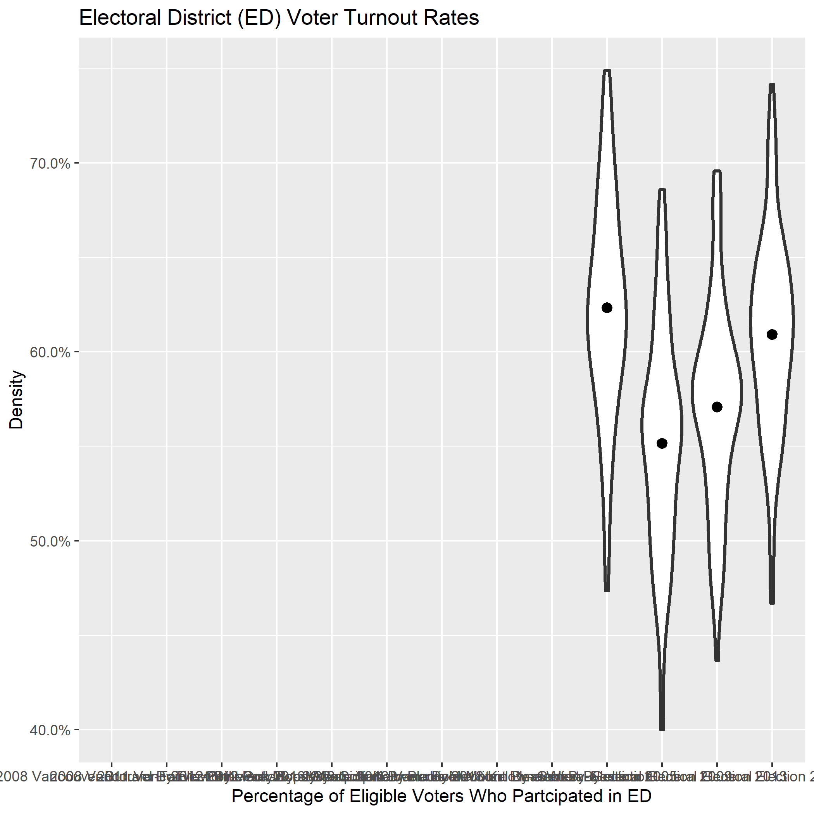
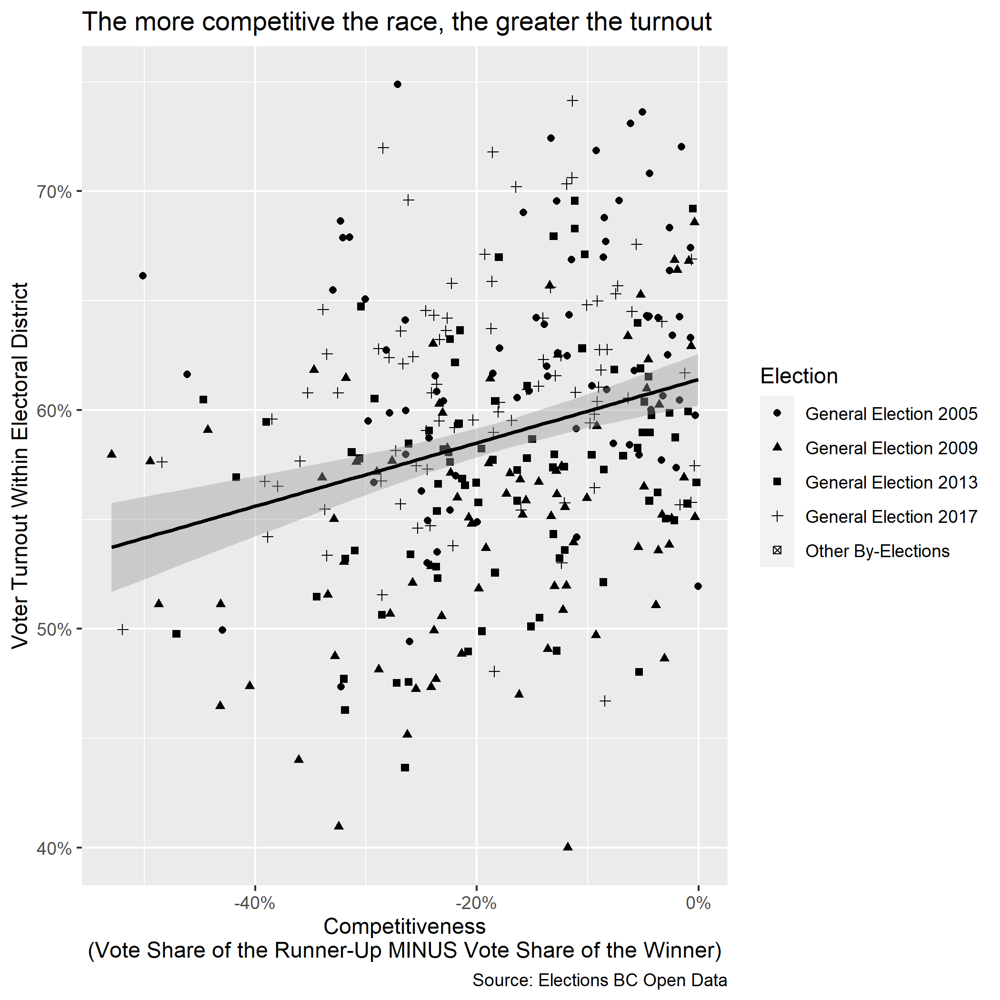

```{r setup, include=FALSE}
knitr::opts_chunk$set(echo = TRUE)
knitr::opts_knit$set(root.dir = here::here())
```

## EDA analysis

Violin plot:
This violin plot shows turnout rate by election districts for election held in 2005, 2009, 2013 and 2017. 


Correlation matrix:
The correlation matrix indicates that there is 0.27 correlation between turnout and competitiveness. In subsequent analysis, we will test if this correlation is just spurious or statistically significant. 


Scatter plot:
The scatter plot shows the correlation between turn out rate per election district and competitiveness. Turn out rate of different election years are marked with different symbols. As we can see, a positive relationship is observed between turnout rate and competitiveness. And this relationship will be further tested in our statistical analysis below. 
